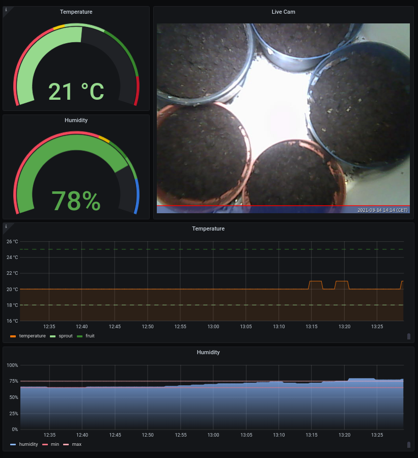

# chili-metrics
Very simple planter monitoring

## Disclaimer

This is a quick-and-dirty toy project meant to run on a secured home network.

## Screenshot


## Hardware
* [Raspberry pi](https://www.raspberrypi.org/products/raspberry-pi-3-model-b/)
* [DHT11 humidity sensor](https://www.instructables.com/Measuring-Humidity-Using-Sensor-DHT11/)
* Planter - I have a discontinued [IKEA Bittergurker](https://www.carousell.sg/p/ikea-planter-with-light-bittergurka-201695436/)
* Light timer
* USB webcam

## Hardware Setup
Connect the humidity sensor to the raspberry pi 
* [3-pin](https://www.circuitbasics.com/wp-content/uploads/2015/12/How-to-Setup-the-DHT11-on-the-Raspberry-Pi-Three-pin-DHT11-Wiring-Diagram.png)
* [4-pin](https://tutorials-raspberrypi.de/wp-content/uploads/2015/08/luftfeuchtigkeit_DHT11_Steckplatine.png)

## Installation

1. [Raspberry Pi OS Lite](https://www.raspberrypi.org/software/)
2. [Grafana](https://grafana.com/tutorials/install-grafana-on-raspberry-pi/)
```
wget -q -O - https://packages.grafana.com/gpg.key | sudo apt-key add -
echo "deb https://packages.grafana.com/oss/deb stable main" | sudo tee -a /etc/apt/sources.list.d/grafana.list
sudo apt-get update
sudo apt-get install -y grafana
sudo /bin/systemctl enable grafana-server
sudo /bin/systemctl start grafana-server
sudo grafana-cli plugins install pierosavi-imageit-panel
sudo /bin/systemctl restart grafana-server

```
3. [Prometheus](https://prometheus.io/)
```
mkdir -p pics prometheus/data
wget https://github.com/prometheus/prometheus/releases/download/v2.25.0/prometheus-2.25.0.linux-armv7.tar.gz
tar xfz prometheus-2.25.0.linux-armv7.tar.gz
mv prometheus-2.25.0.linux-armv7/prometheus prometheus/
cp prometheus.yml ~/prometheus/

sudo cp prometheus.service /etc/systemd/system/
sudo systemctl enable prometheus.service 
sudo systemctl start prometheus
curl localhost:9090/
```

4. Humidity Exporter
```
chmod 755 humidity.py
sudo cp humidity_exporter.service /etc/systemd/system/
sudo systemctl enable humidity_exporter.service 
sudo systemctl start humidity_exporter
curl localhost:9817
```

5. Webcam
```
chmod 755 take_picture.sh
sudo apt install fswebcam
crontab -e
* * * * * /home/pi/take_picture.sh 2>&1 >> /dev/null
```

6. File Server
```
sudo cp python_http_server.service /etc/systemd/system/
sudo systemctl enable python_http_server.service 
sudo systemctl start python_http_server
```

7. Grafana Setup
   1. Log into grafana (raspberry pi's ip:3000) with admin/admin.  Change the password.
   2. Left panel -> Gearbox -> Data Sources -> Add Data Source -> Prometheus -> http://192.168.1.108:9090/ -> Save & Test
   3. Left panel -> + sign -> Import -> Upload JSON file -> Chili_Metrics.json

## Contributing
Pull requests are welcome. For major changes, please open an issue first to discuss what you would like to change.

## License
[MIT](https://choosealicense.com/licenses/mit/)
